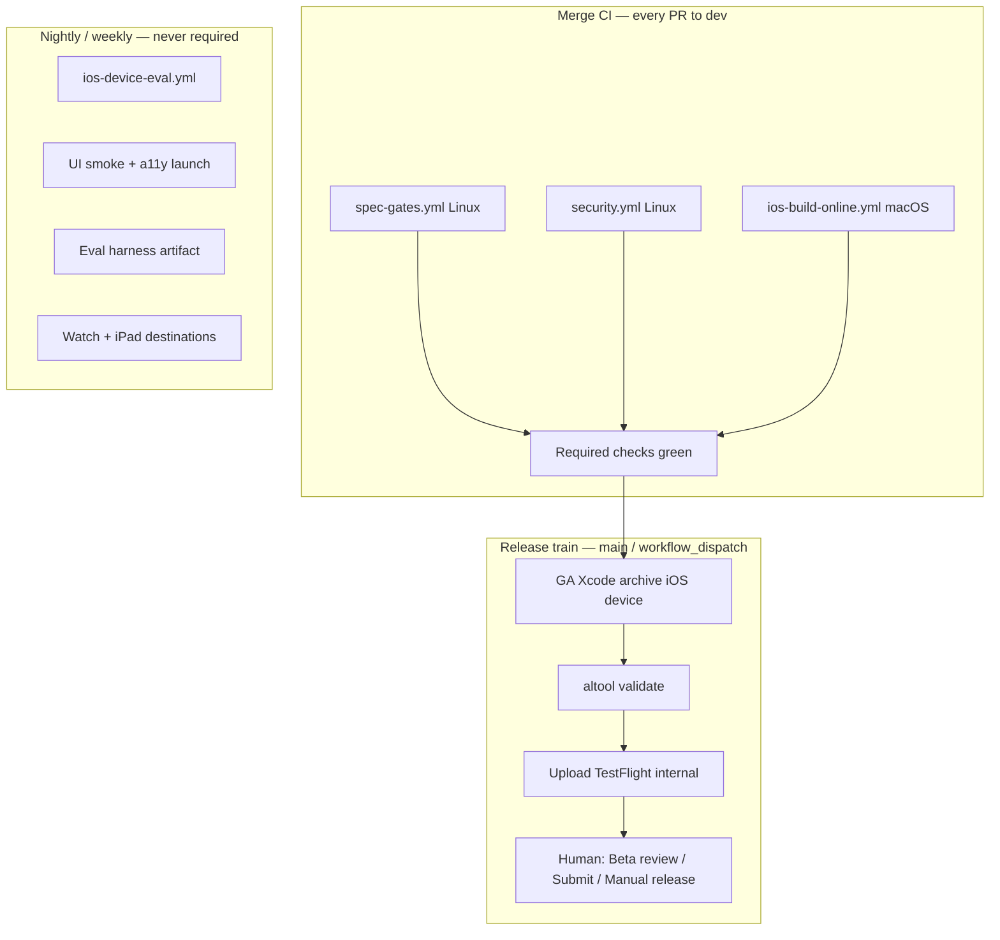

# CI/CD pipeline — inventory, principles, and build-out

This is the operator-facing map of **what Memento already proves in CI**, **what is
still missing for honest builds and releases**, and **what to enable next**. The
executable work-stream is [`specs/052-cicd-pipeline-and-release-automation.md`](../specs/052-cicd-pipeline-and-release-automation.md).

The product is an **on-device iOS journal** (bundle `com.sebastianmendo.MeetMemento`,
display name Memento). There is **no backend deploy**. “CD” means **archive →
validate → TestFlight → App Store**, not `vercel --prod` or `supabase db push`.

---

## 1. Apple principles this pipeline follows

These are the rules that beat generic “add more GitHub Actions” advice. They come
from how Apple actually accepts binaries, plus this repo’s constitution
(`specs/CONSTITUTION.md`).

| Principle | What it means here |
|-----------|-------------------|
| **Ship only GA toolchains** | Archive with **release Xcode 26.x**, never a beta. Apple rejects App Store builds made with beta software. `REQ-PLAT-001` (iOS 27) waits for a GA Xcode 27. |
| **Prove the binary, not the source** | Store/ITMS defects appear in the **archived product**. Merge CI that only `xcodebuild test`s a Debug simulator is necessary but not sufficient. |
| **Validate before upload** | `xcrun altool --validate-app` is free and does **not** consume a build number. Upload without it is how ITMS-91053/91055 show up too late. |
| **One artifact, many promotions** | Archive once. The same `.ipa` goes to internal TestFlight, then Beta App Review, then the App Store version. Do not rebuild for “prod.” |
| **TestFlight is the rehearsal (Gate T)** | External TestFlight is Beta App Review. Treat it as the first real review, not a side channel. |
| **Manual 1.0, phased updates** | 1.0: **Pending Developer Release**. Every later version that touches capture, transcription, or intelligence: **7-day phased release**. That is the only rollback without a server. |
| **Honest green** | A required check must prove what it claims. On-device Foundation Models generation **cannot** be a merge blocker (spec 025). Coverage floors must match the suite that actually ran. |
| **Privacy is the product** | No third-party crash/analytics SDK. dSYMs go to Apple (`uploadSymbols`). Crash triage is Organizer + TestFlight. New packages go through the dependency allowlist. |
| **Human gate for store** | Typed confirmation / Account Holder actions stay. CI may *prepare* an archive; it must not silently press Submit or flip availability. |
| **Accessibility is a release surface** | Dynamic Type, Reduce Motion, VoiceOver labels, and VoiceOver/Voice Control on capture are App Review surfaces (Guideline 2.3 / 4.x), not polish. |
| **Symbols always** | `DEBUG_INFORMATION_FORMAT = dwarf-with-dsym` + `uploadSymbols`. UUID of binary and dSYM must match or Organizer is useless. |

**Xcode Cloud vs GitHub Actions.** Apple’s native CI (Xcode Cloud) is the best
*signing + TestFlight* path. This repo’s **constitutional gates are Linux shell
and must stay on GitHub** (forbidden-phrase lint, privacy manifest, corpus,
allowlist). Target is a **hybrid**: GitHub for governance + online tests; a
signed Mac (hosted `xcode-27` for compile; signing/TestFlight later via an
`app-store` environment or Xcode Cloud) for archive/validate/upload.

---

## 2. What is already live (do not rebuild)

### Merge CI (required in policy; operators must still pin the check names)

| Lane | Workflow | Runner | Proves |
|------|----------|--------|--------|
| Spec gates (2.0) | `spec-gates.yml` | `ubuntu-latest` | Single `FoundationModels` importer; no hardcoded context budgets; REQ-POS-001 phrases; speakability selftest; SPM allowlist; privacy manifest both directions; Info.plist / build-number floor; archive-hygiene membership; live legal URLs; TTS licence/G2P scan; ASC metadata limits; fixture corpus + gold sync; single CoreML importer; TTS zero-egress; no SiriKit |
| Security | `security.yml` | `ubuntu-latest` | gitleaks; dependency-review **critical** on PRs; Sonar **skipped** when unset |
| iOS build (online) | `ios-build-online.yml` | `xcode-27` (hosted) | Build-spec assert; changed-file SwiftLint (blocking on PR); `CI_ONLINE=1` unit tests; coverage ratchet (floor **13%**); Release simulator size vs 200 MB; Periphery PR regression; LFS cache + pointer fail-fast |
| Device / eval | `ios-device-eval.yml` | self-hosted macOS, **not required** | Weekly/dispatch; live FM if present; Spotlight spikes on demand |

### Store / release docs (process, not automation)

- Archive / export / validate / upload commands: `docs/app-store/07-build-signing-and-upload.md`
- TestFlight Gate T: `docs/app-store/09-testflight.md`
- Phased release + Organizer: `docs/app-store/10-release-and-availability.md`
- Branch model: `docs/BRANCHING_AND_CI_POLICY.md` (`feature → dev → main`)
- Runners: `docs/CI_RUNNERS.md`
- Branch protection: `docs/BRANCH_PROTECTION_SETUP.md`

### Already-good test inventory (online)

~90 unit files covering encryption, PIN/security, app-state, journal, retrieval,
trust zones, safety, speakability, prompt registry, channels, insights, Watch-adjacent
contracts, and eval *helpers*. UITests exist (`MeetMementoUITests`, including a
`runsForEachTargetApplicationUIConfiguration` launch test) but are
`-skip-testing` in merge CI.

---

## 3. Gaps (the actual CD hole)

`docs/app-store/07` is explicit: **there is no release automation.** No headless
signing, no archive job, no `altool --validate-app` in CI, no TestFlight upload,
no build-number bump bot. Export has **never completed** on the current Mac
(Distribution cert vs store profile). PLA acceptance (Gate T A1) still blocks a
reproducible signed archive.

Other honesty gaps:

| Gap | Why it matters |
|-----|----------------|
| No device `generic/platform=iOS` archive in CI | Size gate is simulator Release; App Store thinning and entitlements are different |
| No `altool --validate-app` | Highest-value missing step; ITMS is the real compiler for store metadata |
| No XCTest plan | Skip lists are CLI flags; easy to re-introduce device suites into merge CI |
| UITests skipped | Launch / onboarding / PIN / TTS read-aloud / upgrade migration never run in CI |
| Single sim destination (iPhone 17) | App is universal; spec 040 iPad regular-width is unbuilt in merge CI |
| Watch scheme not in merge | `MeetMementoWatch/` compiles only if someone opens it |
| `STOREKIT_ENFORCE=0` | Placeholder IAP IDs would not fail merge |
| Eval gates not scheduled as artifacts | spec 022 / 036 Gate V remain local device work |
| No dSYM UUID assertion | Crash pipeline can silently break |
| Dependabot = Actions only | SPM / Xcode project pins are unattended |
| No CODEOWNERS path for `scripts/ci/` | Workflow owners miss the scripts that *are* the gates |
| Branch-protection rename still a user action | Docs still say operators must replace `iOS quality gates` |

Landed on `main` since the first draft of this doc (2026-09-23+): hosted
`ubuntu-latest` + `xcode-27` merge lanes; workflow `concurrency`; Sonar skip
when unconfigured; LFS cache + pointer fail-fast on the iOS job; Periphery
install pinned. Coverage rollout doc now matches the 13% floor.

---

## 4. Target pipeline (lanes)



**Promotion rule:** only SHAs that are on `main` (or a `release/*` tag cut from
`main`) may archive. `dev` is integration; `main` is the release candidate.

---

## 5. Complete item list (what to build)

Grouped by phase. Checkboxes are the implementation backlog (owned by spec 052).

### Phase A — Honesty and operator wiring (no new product surface)

- [ ] Confirm GitHub branch protection uses **`iOS build (online)`**, spec-gate
      job names, `Dependency review`, `Secret scanning`. Remove `iOS quality gates`.
- [x] `concurrency:` groups on merge workflows (`cancel-in-progress` on PRs) —
      landed on `main` 2026-09-23.
- [x] Sonar skips when unconfigured (does not fail the security workflow).
- [x] iOS job LFS cache + fail-fast if pointer files survive checkout.
- [ ] Extend CODEOWNERS to `scripts/ci/` and `docs/app-store/`.
- [ ] Dependabot `swift` / weekly SPM review, or a documented “no SPM deps”
      assertion (allowlist is already empty — keep it that way).
- [ ] Re-measure `MIN_COVERAGE` on the current online suite and ratchet **up**
      (never invent 60% until the number is real).
- [ ] Flip `STOREKIT_ENFORCE=1` before Gate S if IAP ships; keep 0 only with a
      dated comment pointing at `DEC-004`.
- [ ] Pin Homebrew tools on the Mac runner (document in `CI_RUNNERS.md`) so
      `brew install swiftlint` / Periphery is not every job.

### Phase B — Test contract (Apple-shaped XCTest)

- [ ] Add `MeetMemento.xctestplan` with two configurations:
      **Online** (`CI_ONLINE=1`, skip UITests + `IntelligenceServiceTests`
      generation + spikes + device TTS) and **Device**.
- [ ] Point `ios-build-online.yml` at `-testPlan MeetMemento` / Online config
      instead of a growing `-skip-testing` list.
- [ ] **Launch smoke UITest** (existing `MeetMementoUITestsLaunchTests`) on
      nightly, then on `main` PRs once stable: launch, screenshot, no crash.
- [ ] Second destination in nightly: `platform=iOS Simulator,name=iPad Pro 13-inch,OS=latest`.
- [ ] Compile (not necessarily test) `MeetMementoWatch` on nightly.
- [ ] Accessibility launch pass: Dynamic Type XXXL + Reduce Motion via
      `runsForEachTargetApplicationUIConfiguration` (already on the launch test).
- [ ] Unit tests still missing as *merge* confidence: SwiftData
      `SchemaMigrationPlan` stages (spec 015), CloudKit-compat property rules
      (no `.unique`), file-protection class assertion, Restore Purchases
      StoreKit `Product.displayPrice` (no hardcoded price).

### Phase C — Release CD (the missing pipeline)

Secrets (GitHub Environment `app-store`, **required reviewers**, never on PRs):

| Secret | Use |
|--------|-----|
| `ASC_KEY_ID` | App Store Connect API key id |
| `ASC_ISSUER_ID` | Issuer |
| `ASC_API_KEY_P8` | Key contents; write to `~/.appstoreconnect/private_keys/AuthKey_*.p8` on the runner only |
| Distribution cert + profile **or** API key + `-allowProvisioningUpdates` | Headless automatic signing |

Workflow `release-ios.yml` (`workflow_dispatch` + push tags `v*` on `main`):

1. Re-run / require the three merge lanes on that SHA (Checks API — spec 006 R2 pattern).
2. Assert **GA** Xcode (`xcodebuild -version` has no `beta` / no `Beta`).
3. `xcodebuild archive` `-destination 'generic/platform=iOS'` `-configuration Release`.
4. `plutil -p` archived `Info.plist`: usage strings, `ITSAppUsesNonExemptEncryption`,
   no placeholder URL, build ≥ `last-uploaded-build.txt`.
5. List archive product: no `.xcconfig`, `.md`, `.storekit`, `supabase/`, `specs/`.
6. `dwarfdump --uuid` binary vs dSYM — must match.
7. `xcodebuild -exportArchive` with committed `ExportOptions.plist`.
8. `xcrun altool --validate-app` — **fail the job on any ITMS error**.
9. Upload to TestFlight **internal** only (`altool --upload-app` or
   `xcodebuild -exportArchive -destination upload`).
10. Bump / record `docs/app-store/last-uploaded-build.txt` in a follow-up commit
    **after** Apple accepts the build (not before — failed uploads still consume
    numbers if they were accepted into processing).
11. Never submit for App Review from CI.

Optional later: Xcode Cloud workflow that performs steps 3–9 and posts the
build number back to GitHub.

### Phase D — Quality that cannot be merge-blocking

Wire as **artifacts + Slack/email**, `continue-on-error`, never branch protection:

| Lane | Cadence | What |
|------|---------|------|
| Device eval | Weekly (exists) | Live FM; spikes on dispatch |
| Retrieval / Persona / Grounding gates | When 022 harness is deterministic | Fixture corpus only; never user store |
| Gate V (neural TTS) | Per voice/engine change | Physical device + zero-egress proxy (spec 036) |
| Instruments / Foundation Models instrument | Pre-release | Latency budgets from spec 029 |
| Crash rate | Weekly post-TF | Organizer + ASC Trends — human, not CI |
| Upcoming Apple requirements | Per release | `developer.apple.com/news/upcoming-requirements/` |

---

## 6. What to test (recommended matrix)

### Always on the PR (online)

1. **Constitutional Linux gates** — already listed; keep blocking.
2. **Compile** MeetMemento Debug + online XCTest.
3. **Security paths** — encryption round-trip, PIN constant-time compare,
   lock/onboarding state (tests exist; keep them in the Online plan).
4. **Privacy / store scripts** — manifest ↔ code, legal URLs, ASC copy.
5. **Intelligence boundary** — mocks only; single-importer grep.
6. **TTS path legality** — GPL/G2P/zero-egress + acknowledgments licence tests.
7. **App size** — Release product vs 200 MB cellular tax.
8. **Changed-file SwiftLint** including `no_print`.

### Nightly / `main`

9. **Launch UITest** + configuration matrix (appearances).
10. **Onboarding + PIN happy path** (`MeetMementoOnboardingPinUITests`) once
    un-flaked.
11. **iPad destination** compile + a subset of unit tests.
12. **Watch** compile.
13. **Speakability lint on generated fixtures** when 022 writes files
    (`speakability_lint.py` is already waiting for this).

### Device / pre-release only

14. Live `IntelligenceService` ask/summarize.
15. Spotlight donation visibility (Spike C / DEC-002).
16. SpeechAnalyzer capture → reflection (mic + Apple Intelligence hardware).
17. Neural TTS AEC / Gate V.
18. CloudKit private-DB second-device smoke (two iCloud accounts, not CI).
19. StoreKit sandbox purchase + Restore Purchases.
20. VoiceOver pass on capture and chat (Guideline 2.3 screenshots later).

### Do **not** put in merge CI

- Anything that `XCTSkip`s without a model (it is theater).
- Network calls to Z2 except the already-gated legal-URL fetch and (optional)
  spec 042 write-only path behind a stub.
- LLM-as-judge (022 still open).
- Real journal content.

---

## 7. Release train (human + machine)

```
feature PR → dev
  required: online lanes
dev PR → main
  required: online lanes + up-to-date + 1 review
tag v1.0.x or dispatch release-ios
  machine: archive, validate, TestFlight internal
Account Holder
  Beta App Review (first build of a version)
  Submit for Review
  1.0: Manual release
  1.x+: Phased release
  Update last-uploaded-build.txt
```

**Rollback:** pause phased release or submit a hotfix build. There is no server
flag. Do not remove the app from sale to “stop” a phase (that permanently
completes the rollout).

---

## 8. Secrets and environments

| Environment | Who can approve | Secrets |
|-------------|-----------------|---------|
| *(none)* | — | Merge CI: `SONAR_TOKEN` optional |
| `app-store` | Account Holder | ASC API key + signing material |

Never commit `.p8`, `.p12`, `.mobileprovision`.
`git ls-files | grep -cE '\.p8$|\.p12$|\.mobileprovision$'` must stay **0**
(already a 07 verification).

---

## 9. Related docs

| Doc | Role |
|-----|------|
| `specs/052-cicd-pipeline-and-release-automation.md` | Executable requirements / tasks |
| `specs/025-ci-online-ios-build-gates.md` | Online vs device split (done) |
| `specs/006-ci-and-build-config-integrity.md` | Honest gates (done) |
| `docs/app-store/07-build-signing-and-upload.md` | Manual commands this CD automates |
| `docs/app-store/00-readiness-checklist.md` | Gate T / S / L |
| `docs/CI_RUNNERS.md` | Labels and software |
| `docs/BRANCH_PROTECTION_SETUP.md` | Required check names |
